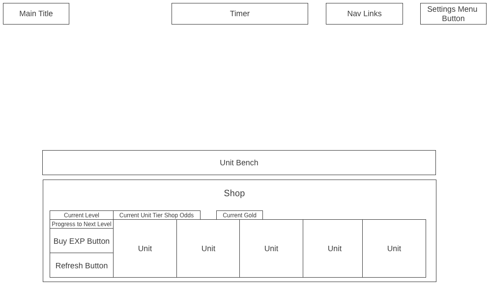

# TFT Star Up

## Background

TFT Star Up is a tool for practicing one’s shop rerolling skills based on 
gameplay from the auto battler videogame [Teamfight Tactics (TFT)].  Each 
round in a TFT game begins with a timed planning phase in which players can 
take several actions to strategize, such as:

- Buy experience to level up and improve shop odds for being offered 
high-tier units
- Spend gold to buy units offered to them in their shop
- Refresh their shop to try finding specific copies of units

Players may need to refresh their shop multiple times (**“rolling down”**) 
within a single planning phase to find particular units they want, and how
well they can repeatedly refresh and buy within a short time can often 
be the difference between victory and defeat.

## Functionality  & MVPs

TFT Star Up's interface will resemble the user interface of TFT, but 
user interaction will focus exclusively on the game aspects integral to 
rolling down: the **shop** and **unit bench**.  In the tool, users will be 
able to:

- Configure settings for their rolldown, such as the timer, starting level, 
starting gold, and starting units on the bench
- Remap the hotkeys for buying experience, shop refreshes, and selling units
- Make shop purchases by either clicking on a unit or by dragging it
outside of the shop

Additionally, this project will include: 

- A **Welcome** modal describing how to use the tool and input fields 
for configuring rolldown settings
- A production README

## Wireframes

- Timer will show the configured time for the rolldown and can be configured
- Nav links includes links to this project's Github repo and my LinkedIn
by the user
- Settings Menu Button will open the Welcome modal that has instructions
for the tool and input fields for configuring rolldown settings
- The Unit Bench will show the purchased units, which can be sold by either
dragging them over the Shop or pressing E while holding it or hovering over 
it
- Buy EXP and Refresh buttons will display the amount of gold they cost and 
the hotkeys they are mapped to
- Units can be purchased by either clicking or dragging them outside the 
shop; they will display the unit's name, icon, traits, tier, and cost

## Technologies, Libraries, APIs

This project will be implemented with the following technologies:

- Static TFT set data from [Riot Games’ developer portal site]
- `Webpack` and `Babel` to bundle and transpile the source JavaScript code
- `npm` to manage project dependencies

## Implementation Timeline

- Friday Afternoon & Weekend: Setup project, including getting webpack up
and running. Create Shop, Bench, and Unit classes. Get HTML elements 
rendered to the webpage reflecting the overall layout of the site.

- Monday: Dedicate this day toward implementing the underlying logic of 
TFT Star Up. Ensure that I buy units, experience, and shop refreshes and  
have the correseponding objects updated appropriately. If there is 
time, make sure this is all rendered correctly on the webpage.

- Tuesday: If I didn't get to it already, get the shop, units, and bench 
correctly rendered on the webpage. Make sure they rerender correctly when I
make a purchase or sell a unit. Then, focus on rolldown setting 
configuration: adjusting starting time, starting gold, starting level, and 
starting units on bench.

- Wednesday: Finish implementing user controls, and focus on styling, as  
well as implementing the different unit tier color schemes and nav links. 
If time, start on bonuses.

- Thursday Morning: Deploy to GitHub pages. If time, rewrite this proposal 
as a production README.

## Bonus Features

There are many features this rolldown practice tool could eventually have 
available.  Some anticipated updates could allow users to:
- Change the arena skin background
- Move units around on the bench
- Adjust the difficulty of rolldowns, such as changing unit appearance
in the shop and toggling random changes to the unit pool
- Set rolldown challenges or objectives, such as creating a checklist of 
specific units to buy and customizing desired star levels for units

## Riot Games Legal Boilerplate 

TFT Star Up was created under Riot Games' "Legal Jibber Jabber" policy 
using assets owned by Riot Games.  Riot Games does not endorse or sponsor 
this project. 

TFT Star Up isn't endorsed by Riot Games and doesn't reflect the views or
opinions of Riot Games or anyone officially involved in producing or 
managing Riot Games properties. Riot Games, and all associated properties 
are trademarks or registered trademarks of Riot Games, Inc.

[Teamfight Tactics (TFT)]: https://teamfighttactics.leagueoflegends.com/en-us/
[Riot Games’ developer portal site]: https://developer.riotgames.com/docs/tft