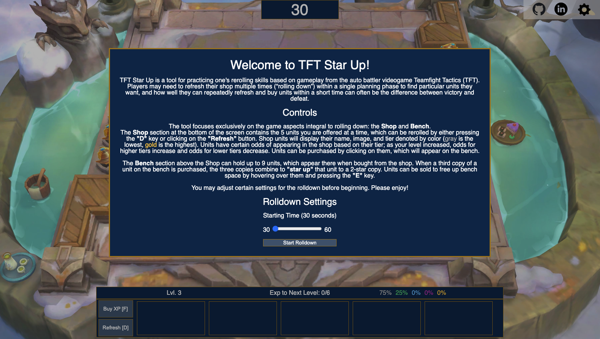

# TFT Star Up

[Live Site](https://mitchellkchan.github.io/TFTStarUp/)

## Background

TFT Star Up is a tool for practicing one’s rerolling skills based on 
gameplay from the auto battler videogame [Teamfight Tactics (TFT)].  Each 
round in a TFT game begins with a timed planning phase in which players can 
take several actions to strategize, such as:

- Buy experience to level up and improve shop odds for being offered 
high-tier units
- Spend gold to buy units offered to them in their shop
- Refresh their shop to try finding specific copies of units

Players may need to refresh their shop multiple times (**“rolling down”**) 
within a single planning phase to find particular units they want, and how
well they can repeatedly refresh and buy units within a short time can often 
be the difference between victory and defeat.

## How to Use

TFT Star Up's interface resembles the user interface of TFT, but 
user interaction focuses exclusively on the game aspects integral to 
rolling down: the **shop** and **bench**.  In the tool, users are able to:

- Configure settings for their rolldown, such as the timer
- Make shop purchases by clicking on a unit from the shop, which then
appear on an empty bench slot
- Upgrade a bench unit's star level (**"star up"** a unit) when a third copy
of a unit is purchased; two of the three copies will combine with the first,
freeing up additional bench space to purchase more units
- Sell a bench unit by presing "E" while hovering over it

Additionally, this project a **Welcome** modal describing how to use the tool 
and input fields for configuring rolldown settings

## Technologies, Libraries, APIs

This project is implemented with the following technologies:

- Static TFT set data from [Riot Games’ developer portal site]
- `Webpack` and `Babel` to bundle and transpile the source JavaScript code
- `npm` to manage project dependencies

## Bonus Features

There are many features this rolldown practice tool could eventually have. 
Some anticipated updates could allow users to:
- Change the arena skin background
- Move units around on the bench
- Drag units out of the shop to buy them
- Drag units off them bench to sell
- Configure rolldown settings such as starting gold and starting bench units
- Adjust the difficulty of rolldowns, such as changing unit appearance
in the shop and toggling random changes to the unit pool
- Set rolldown challenges or objectives, such as creating a checklist of 
specific units to buy and customizing desired star levels for units

## Riot Games Legal Boilerplate 

TFT Star Up was created under Riot Games' "Legal Jibber Jabber" policy 
using assets owned by Riot Games.  Riot Games does not endorse or sponsor 
this project. 

TFT Star Up isn't endorsed by Riot Games and doesn't reflect the views or
opinions of Riot Games or anyone officially involved in producing or 
managing Riot Games properties. Riot Games, and all associated properties 
are trademarks or registered trademarks of Riot Games, Inc.

[Teamfight Tactics (TFT)]: https://teamfighttactics.leagueoflegends.com/en-us/
[Riot Games’ developer portal site]: https://developer.riotgames.com/docs/tft